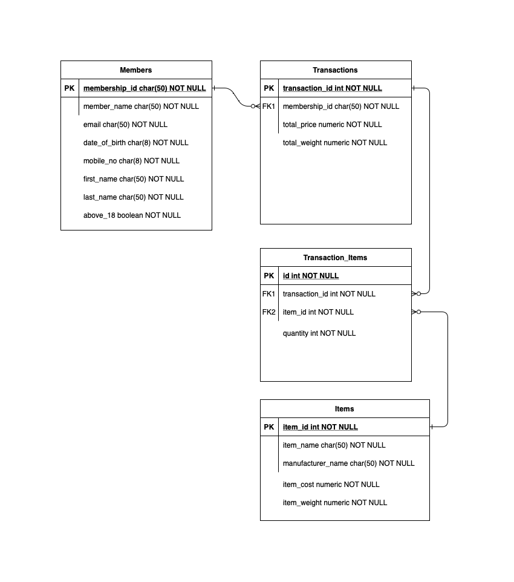

# Section 2: Databases

## How to use
1. Build Image
    ```
    docker build -t benjaminchua/govtech_data_eng
    ```
2. Run Image (i.e. PostgreSQL DB instance)
    ```
    docker run -it --rm -e POSTGRES_PASSWORD=mysecretpassword benjaminchua/govtech_data_eng
    ```
3. Populate Database and Query


# ER Diagram
