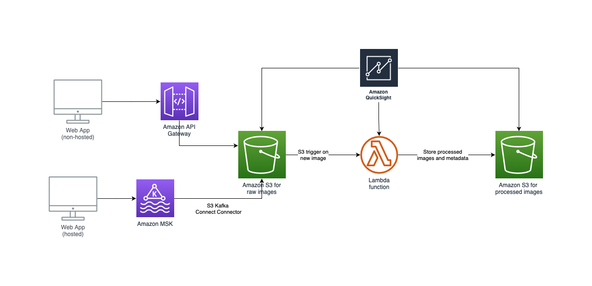

# Section 3: System Design

## System Architecture Diagram using AWS

## Design Decision
1. Choice of AWS as they offers many in-build functionality with ease of implementation, configurability and scalability
2. Paticularly, the Amazon S3 bucket is a good store of images (and its metadata) and has the ability to set up triggers(events) on upload of new images
3. The non-hosted web application can upload images to the S3 bucket via APIs through the Amazon API Gateway
4. The hosted web application can upload images to the S3 bucket via Amazon MSK and Lenses.io S3 Kafka Connect Connector
5. The uploaded images will then be stored in an Amazon S3 bucket as raw images awaiting processing. With a trigger set up, each newly uploaded image would be processed by the lambda function, where the image processing code reside. The processed image (and its metadata) would then be pushed into another S3 bucket for storage and retrieval by the lambda function.
6. The S3 bucket with processed images can also be configured to purge images and its metadata once the 7 days expiration is up.
7. Amazon QuickSight is a BI tool that can provide analysis and visualisation on the image processing pipeline