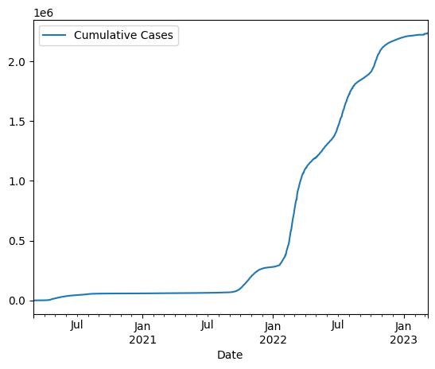

# Section 4: Charts & APIs

## Instructions to run
1. Env set up using requirements.txt
  ```
  pip install -r requirements.txt
  ```
2. Run _chart.ipynb_

## Chart of cumulative sum of covid19 cases in SG
